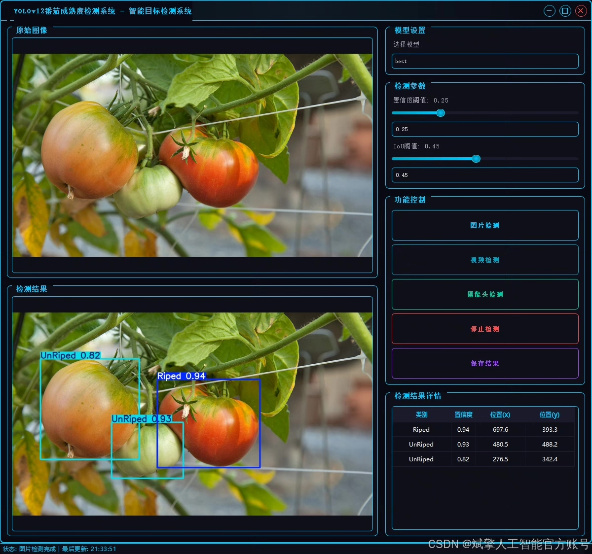
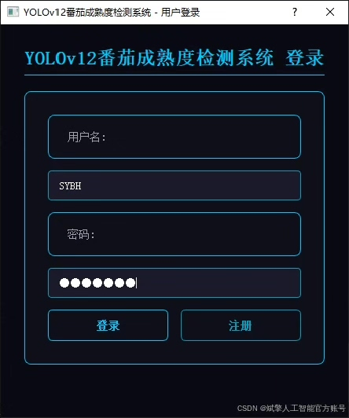
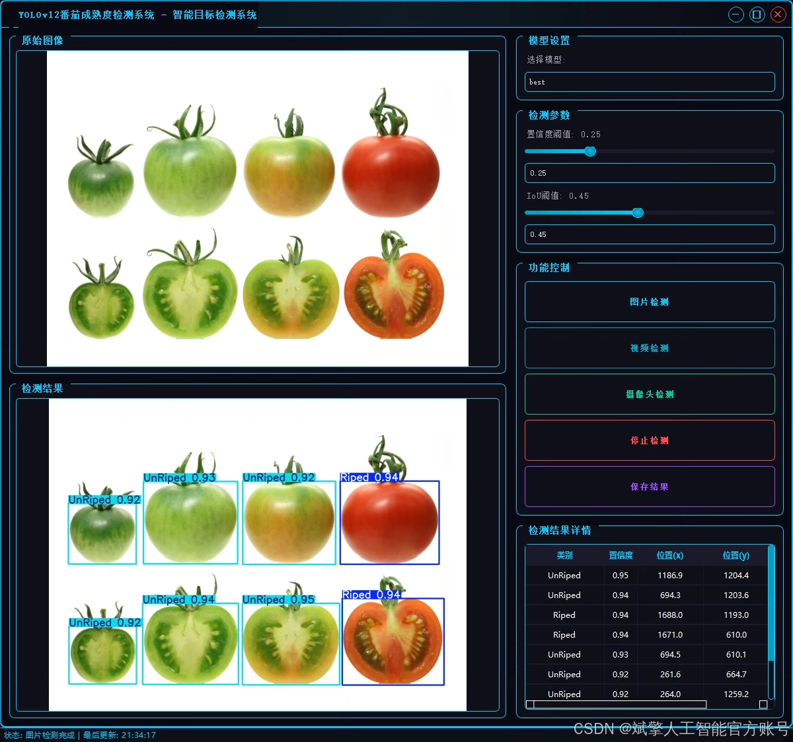
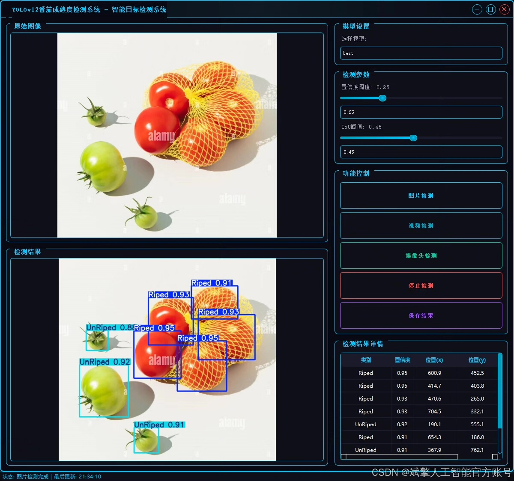
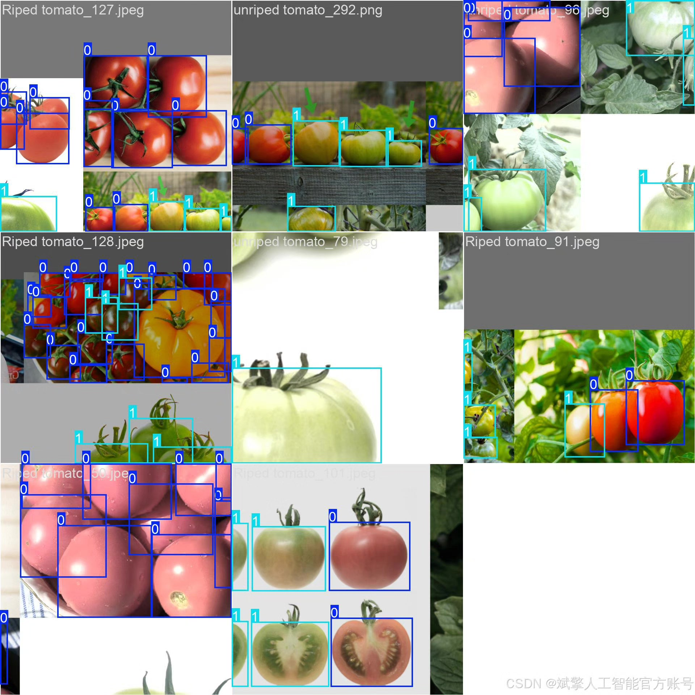
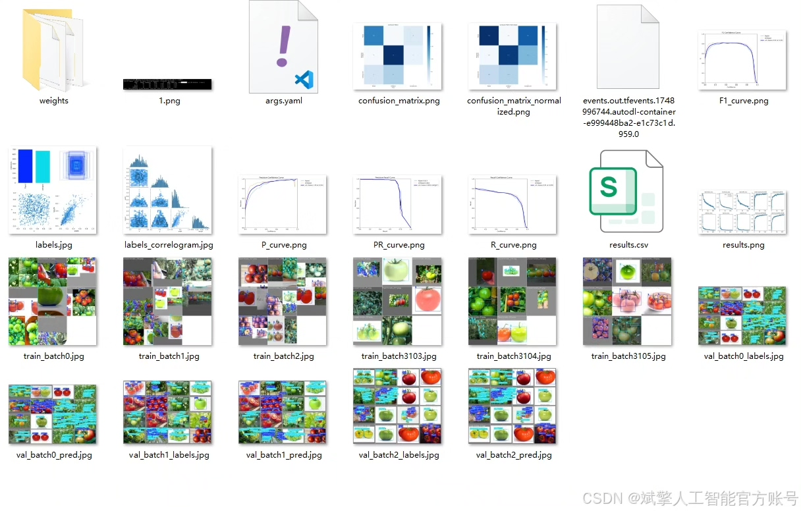
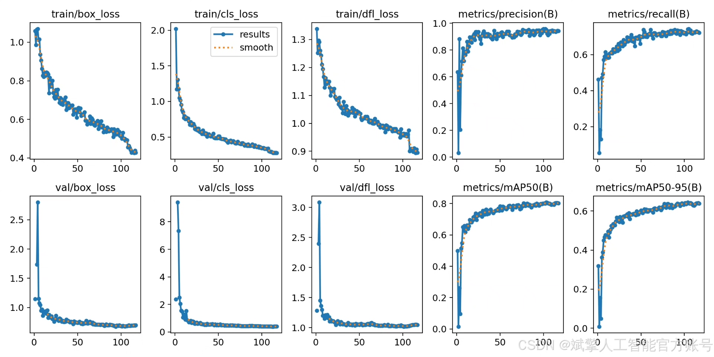
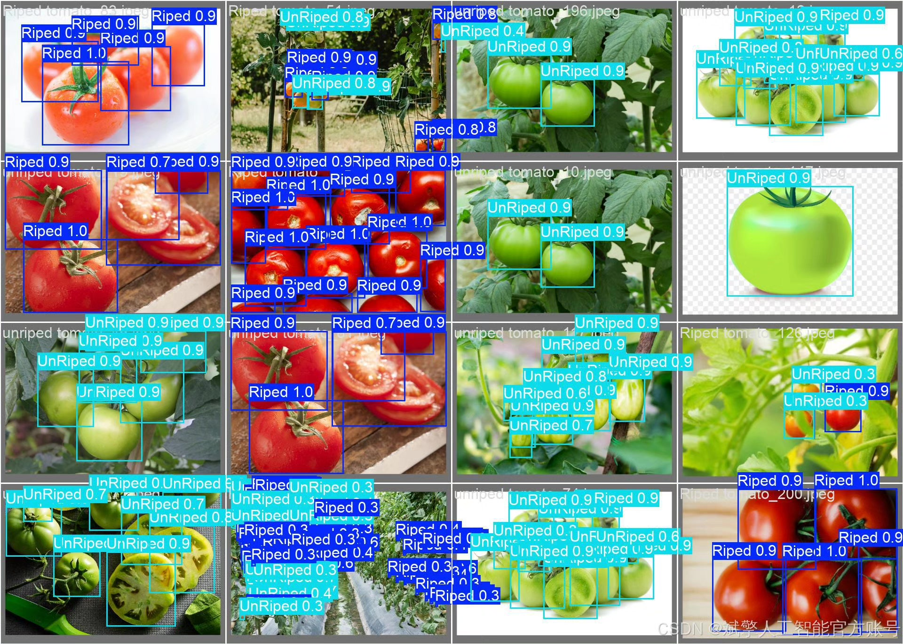

# YOLOv12 Tomato Maturity Recognition Software

## Body

YOLOv12 Tomato Maturity Detection Software Based on Deep Learning YOLOv12: A Tomato Maturity Detection System (YOLOv12+YOLO dataset + UI interface + login registration interface + Python project source code + model)

This paper designs and implements a tomato maturity intelligent detection system based on deep learning YOLOv12. It uses computer vision technology to classify tomato fruits in real-time. The system is centered around the YOLOv12 model, optimizing for two target classes (ripe tomatoes and unripe tomatoes). The dataset is in the standardized YOLO format, containing tomato images under various lighting conditions, angles, and obstructions, ensuring model robustness. The frontend provides a user-friendly UI interface with integrated login and registration functions, while the backend is developed in Python, including complete open-source projects with training codes, model weights, and deployment plans. Experiments show that this system performs excellently in accuracy and real-time performance, offering an efficient solution for agricultural automation in picking and quality classification.

✅ User Login and Registration: Supports password verification and security validation.
✅ Three Detection Modes: Based on the YOLOv12 model, supporting image, video, and real-time camera detection, accurately recognizing targets.
✅ Dual-Screen Comparison: Displaying original images and detection results side by side.
✅ Data Visualization: Real-time table displaying the category, confidence, and coordinates of detected targets.
✅ Intelligent Parameter Tuning: Offers a confidence slide bar for dynamically optimizing detection accuracy, adapting to different scene needs.
✅ Sci-Fi Style Interactive Interface: Dark theme combined with dynamic light effects, reducing visual fatigue and enhancing operational experience.

## Images

## Payment

Here is a pay link on Stripe ( https://buy.stripe.com/3cs8yP7sY87d0vu9AB ). Please contact me lonlonago@foxmail.com after funding $89, and I will send you a complete data files , thank you!

